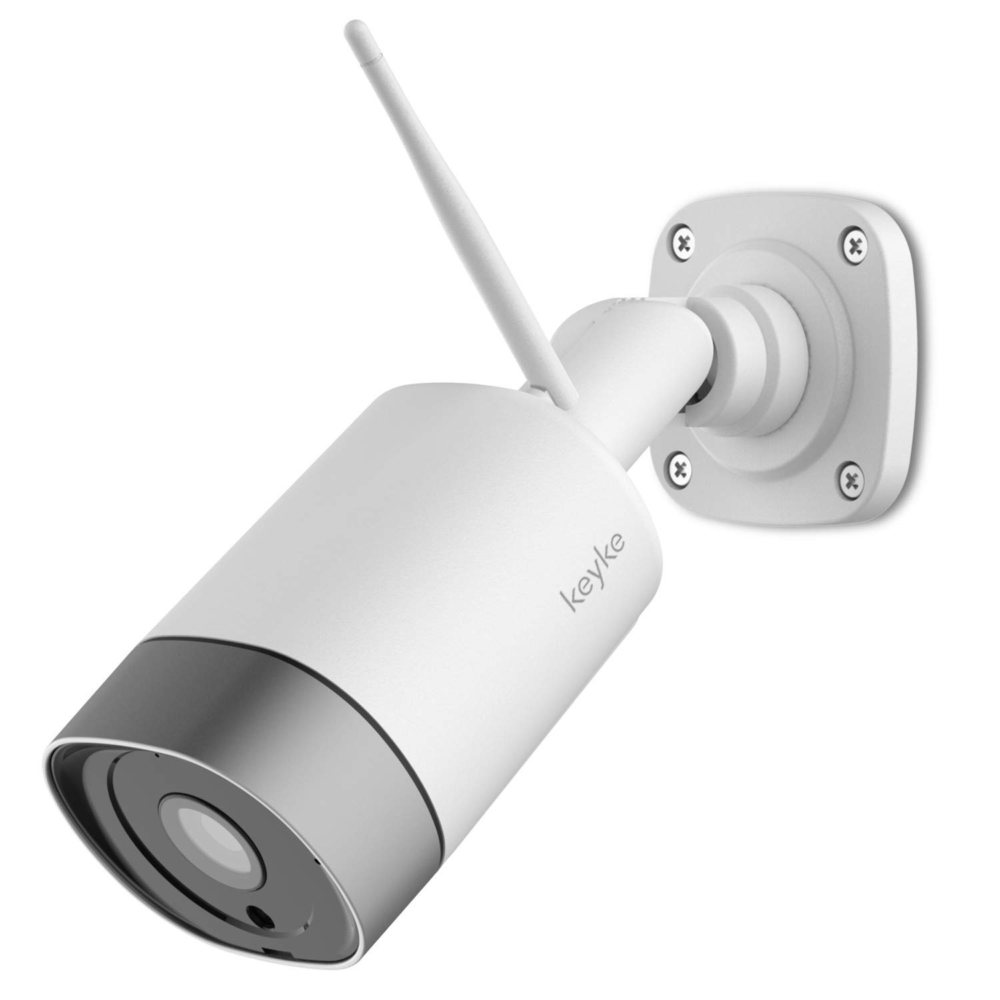

# keyke-hack
This hack includes :
- Telnet server activated
- FTP server activated

for KEYKE camera 1080p based on MStar Infinity3 chipset. 

# Getting Started
! MicroSD card must stay in the camera for this hack to function !

## Prepare the microSD Card
- Clone this repository onto computer: git clone https://github.com/grausof/keyke-hack
- Format a microSD card in FAT32 format and copy the test folder inside sd folder onto root of microSD card. (there must be only one test folder on the sd card)
- In the root of microSD will contain a folder named test.

## Starting your Camera
If the camera is plugged in, unplug the camera.
- Insert the microSD card containing updated test folder.
- Plug in the camera.
- Then the camera will start up, running hack script if your camera's firmware version meets requirements. After plugging in the camera for around 20 seconds, the LED's color stays red. 
- Wait 1 minute and then unplug the camera and remove the sd card 
- In the sd card you will find an 'init.sh.bck' file which is a backup of the replaced file in the camera
- If the file is present, the hack was successful. Now you can connect to the camera via telnet and ftp

If the hack does not work, and the camera stucks during booting process. In this situation, a serial connection to the camera board is required to debug further the problem.

## Using the Camera
You can find the IP address of the camera from the app used for configuration in settings.

### Telnet Server
The telnet server is on port 23.
Default user is root, without password. You can change the password with this command: "/home/app/localbin/busybox passwd"

### FTP Server
The FTP server is on port 21.
No authentication is needed, you can login as anonymous.

## Acknowledgments
Special thanks to the following people.
- @TheCrypt0 - [https://github.com/TheCrypt0/yi-hack-v4](https://github.com/TheCrypt0/yi-hack-v4)
- @xmflsct - [https://github.com/xmflsct/yi-hack-1080p](https://github.com/xmflsct/yi-hack-1080p)
- All the people who worked on the previous projects "yi-hack".

### DISCLAIMER
### I AM NOT RESPONSIBLE FOR ANY USE OR DAMAGE THIS SOFTWARE MAY CAUSE. THIS IS INTENDED FOR EDUCATIONAL PURPOSES ONLY. USE AT YOUR OWN RISK.
